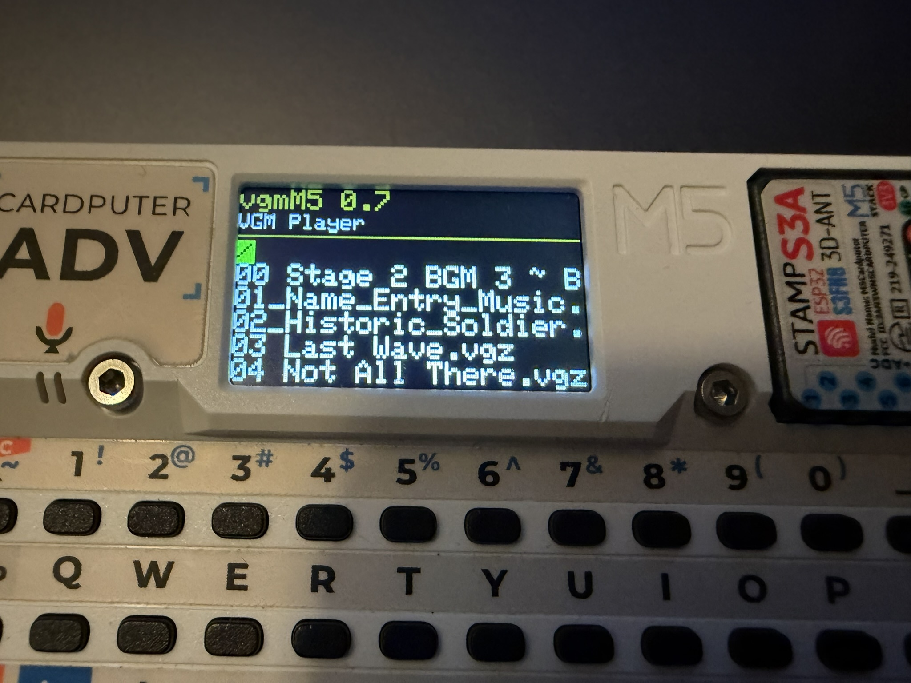

# vgmM5 (Version 0.7)
vgm player for M5Stack

(English version follows below)

---

## 日本語版 (Japanese)

### 概要
vgmM5 は M5Stackシリーズで動作するVGM/VGZファイルプレイヤーです。

#### 対応デバイス (Supported Devices)
| デバイス (Device) | ステータス (Status) | 備考 (Notes) |
| :--- | :--- | :--- |
| **M5Stack AtomS3R (Echo)** | ✔️ 対応済 (Supported) | 内蔵スピーカー専用の最適化EQ搭載・内蔵フラッシュUSBドライブ対応 |
| **M5Stack Cardputer** | ✔️ 対応済 (Supported) | MicroSDカードからの読み込み・キーボード操作対応 |
| **M5Stack CoreS3** | 🔮 将来対応予定 (Future) | |

#### 対応音源チップ (Supported Sound Chips)
| チップ名 (Chip) | ステータス (Status) |
| :--- | :--- |
| **YM2612 (OPN2)** | ✔️ 対応済 (Supported) |
| **YM3812 (OPL2)** | ✔️ 対応済 (Supported) |
| **YM2203 (OPN)**  | ✔️ 対応済 (Supported) |
| **YM2151 (OPM)**  | ✔️ 対応済 (Supported) |
| **SN76489 (DCSG)**| ✔️ 対応済 (Supported) |
| **AY-3-8910 (PSG)**| ✔️ 対応済 (Supported) |
| **YM2149**        | 🔮 将来対応予定 (Future) |
| **Namco C352**    | 🔮 将来対応予定 (Future) |
| **Namco C140**    | 🔮 将来対応予定 (Future) |
| **Famicom (2A03)**| 🔮 将来対応予定 (Future) |
| **SID (MOS6581)** | 🔮 将来対応予定 (Future) |

最大の特徴として、**マトリクス処理による新設計のサウンドエンジン**を搭載しています。これにより、限られたリソースのマイコン上でも効率的に複数のFM音源チップ（YM2612、YM3812、YM2203など）を統合してエミュレーションし、高音質で再生することが可能になっています。

また、AtomS3Rのような極小スピーカーの特性に合わせた専用のイコライザー（EQ）処理を搭載しており、物理的な制約の中でも最大限の音響体験を提供します。

### インストール方法（M5 Burnerを使用する場合）
手軽に楽曲を試したい場合は、M5 Burnerから以下のシェアコードを利用して直接ファームウェアを書き込むことができます。

- **M5Stack Cardputer 用 Share Code:** `w22qj1qpfJsnItOH`
- **M5Stack Atom Echo S3R 用 Share Code:** `c5t52qiD50X3eo58`

---

### 操作方法 (How to Use)

#### 🎧 M5Stack Atom Echo S3R の場合
AtomS3R版は画面がないため、ボタン操作のみで直感的にコントロールできます。起動時は一時停止（無音）状態で待機します。

- **1回クリック**: 再生スタート / 一時停止 (Play / Pause)
- **ダブルクリック**: 次の曲へスキップ (Next Track)
- **3回クリック**: 前の曲へ戻る (Previous Track)
- **長押ししながら起動**: USBドライブモードに入り、PCからVGMファイルを追加可能になります。
  - ※USBドライブが開いたら `.vgm` や `.vgz` ファイルを直接コピーしてください。コピー完了後、再度電源を入れ直すとプレイヤーとして起動します。

#### 💻 M5Stack Cardputer の場合
Cardputer版はMicroSDカード内のファイルをブラウズして再生します。ルートディレクトリに `.vgm` または `.vgz` ファイルを配置してください。

- **Up/Down / 矢印キー**: ファイルの選択 (Select File)
- **Space キー**: 曲の再生/停止 (Play Selected Track)
- **= キー**: 音量を上げる (Volume Up)
- **- キー**: 音量を下げる (Volume Down)

---

### 開発者向け (Note for Developers)
**※AtomS3R版のファームウェア書き換えについて**
AtomS3R版ではUSB MSC（TinyUSBモード）を採用しているため、通常の書き込みポートが見つからなくなる場合があります。PlatformIO等でファームウェアを書き換える際には、**「側面の小さなリセットボタンを長押し（約2秒）」**して、LEDが緑色に点灯する「ダウンロードモード」に入れてから書き込み（Upload）を実行してください。

### ライセンス (License)
本プロジェクトの独自のソースコード（改修部分、マトリクス処理によるサウンドエンジン等）は **MITライセンス** の下で公開されています。

また、本プロジェクトは以下の素晴らしいライブラリ・コード等を利用/参照しています。心より感謝申し上げます。
- [M5Unified](https://github.com/m5stack/M5Unified) - MIT License
- ESP-IDF (FFat / Wear Levelling) - Apache License 2.0
- Puff (zlib decompressor) by Mark Adler - zlib License
- [美咲フォント (Misaki Font)](https://littlelimit.net/misaki.htm) / Little Limit - Free Font License
- [ymfm](https://github.com/aaronsgiles/ymfm) by Aaron Giles - BSD 3-Clause License (参考)
- [MAME](https://github.com/mamedev/mame) - GPL 2.0+ (参考)

---

## English

### Overview
vgmM5 (Version 0.7) is a VGM/VGZ file player designed for the M5Stack series.

#### Supported Devices
| Device | Status | Notes |
| :--- | :--- | :--- |
| **M5Stack AtomS3R (Echo)** | ✔️ Supported | Features optimized EQ for internal micro-speaker & internal USB drive |
| **M5Stack Cardputer** | ✔️ Supported | Supports loading from MicroSD card & keyboard navigation |
| **M5Stack CoreS3** | 🔮 Future | |

#### Supported Sound Chips
| Chip Name | Status |
| :--- | :--- |
| **YM2612 (OPN2)** | ✔️ Supported |
| **YM3812 (OPL2)** | ✔️ Supported |
| **YM2203 (OPN)**  | ✔️ Supported |
| **YM2151 (OPM)**  | ✔️ Supported |
| **SN76489 (DCSG)**| ✔️ Supported |
| **AY-3-8910 (PSG)**| ✔️ Supported |
| **YM2149**        | 🔮 Future |
| **Namco C352**    | 🔮 Future |
| **Namco C140**    | 🔮 Future |
| **Famicom (2A03)**| 🔮 Future |
| **SID (MOS6581)** | 🔮 Future |

Its core feature is a **newly designed sound engine based on matrix processing**. This allows efficient integration and accurate emulation of multiple sound chips (such as YM2612, YM3812, YM2203) on microcontrollers with limited hardware resources.

Additionally, it features a dedicated equalizer (EQ) tailored for the acoustic characteristics of micro-speakers (like the one found in the AtomS3R), delivering the best possible audio experience despite physical constraints.

### Installation (via M5 Burner)
For a quick and easy start, you can flash the firmware directly to your device using M5 Burner with the following share codes:

- **M5Stack Cardputer Share Code:** `w22qj1qpfJsnItOH`
- **M5Stack Atom Echo S3R Share Code:** `c5t52qiD50X3eo58`

---

### Controls

#### 🎧 M5Stack Atom Echo S3R
The AtomS3R version runs headlessly and is controlled via the main screen button. It boots into a paused state.
- **1 Click**: Play / Pause
- **Double Click**: Next Track
- **Triple Click**: Previous Track
- **Hold while booting**: Enters USB Drive Mode to add VGM files from your PC.

#### 💻 M5Stack Cardputer
The Cardputer version plays files directly from a MicroSD card.
- **Up/Down / Arrow Keys**: Select file
- **Space Key**: Play/Stop selected track
- **= Key**: Volume Up
- **- Key**: Volume Down

---

### License
Our original source code, modifications, and the matrix processing sound engine are released under the **MIT License**.

This project utilizes and references the following excellent libraries, code, and assets:
- [M5Unified](https://github.com/m5stack/M5Unified) - MIT License
- ESP-IDF (FFat / Wear Levelling) - Apache License 2.0
- Puff (zlib decompressor) by Mark Adler - zlib License
- [Misaki Font](https://littlelimit.net/misaki.htm) / Little Limit - Free Font License
- [ymfm](https://github.com/aaronsgiles/ymfm) by Aaron Giles - BSD 3-Clause License (Reference)
- [MAME](https://github.com/mamedev/mame) - GPL 2.0+ (Reference)
